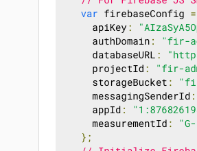
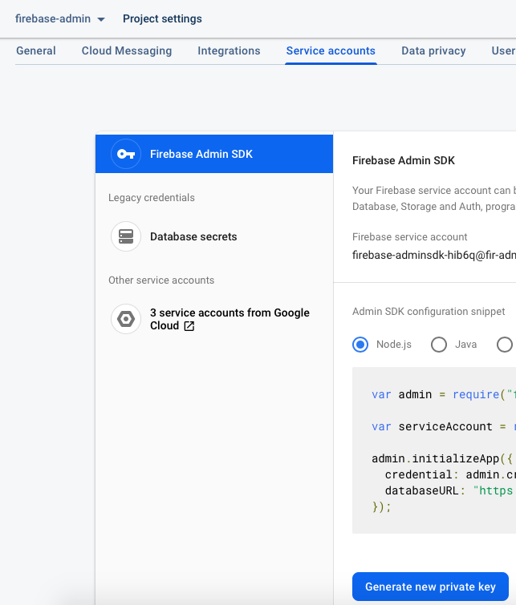
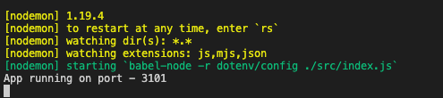
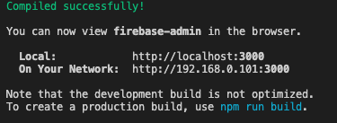

# Steps for running

### Prerequisites

Install [https://nodejs.org/en/](NodeJS LTE version)

<p>&nbsp;</p>

## Setting up Firebase

Open your Firebase Console. Select your project and go to Project settings.
<br />
Select `General` tab. Scroll below and find `databaseURL` under `SDK setup and configuration`.



Copy the value and paste it in the `/backend/.env` file against key `FIREBASE_DATABASE_URL`. **Do not change the key.**

<p>&nbsp;</p>

Select Service accounts tab and click on the button `Generate new private key`. It will download a json file.



<br />
Rename the downloaded file as `serviceAcccountKey.json`.
<br />
Replace `/backend/serviceAcccountKey.json` with your new `serviceAcccountKey.json`.

<p>&nbsp;</p>

## Start server

From project's root directory, **open a terminal** and run the following commands:

```
npm install
npm run start
```

It will leave you with the below information in the terminal.

Successful backend backend screenshot
<br />


<br />

Successful frontend screenshot
<br />



**Do not close this terminal**

<p>&nbsp;</p>

Open [http://localhost:3101](http://localhost:3101) to view it in the browser.


## Heroku Deployment
Please ensure you have heroku account. If not please follow the instruction from here
https://signup.heroku.com/

<p>
Please perform the following steps to deploy in heroku
1. Go to project root directory and run 'heroku create' command.
Copy the URL generated by heroku create command and paste it in frontend/.env file against key REACT_APP_BACKEND
2. Execute the below commands
2.1 cd frontend
2.2 npm install
2.3 npm run build
2.4 copy frontend/build folder and paste inside backend folder
3. Go to project root directory and apply the below commands
3.1 execute 'git push heroku master' command
3.2 execute 'heroku ps:scale web=1' command and wait for 5 mins.
3.3. execute 'heroku open'
</p>
